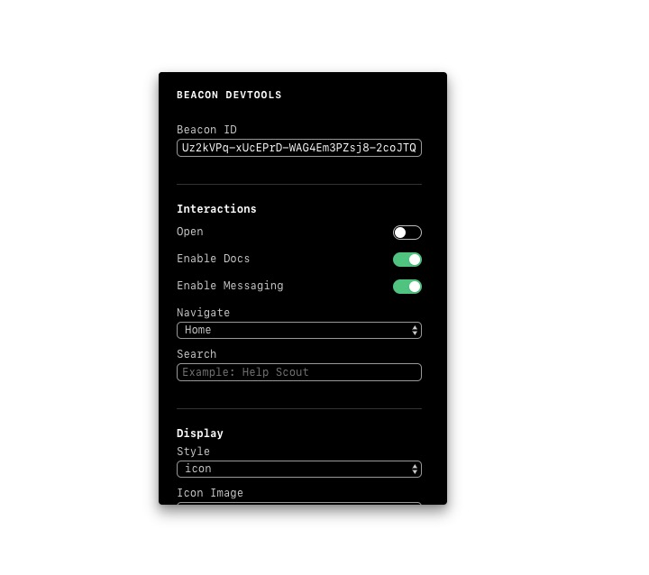

# Beacon DevTools

> DevTools for Help Scout's Beacon Embed



## Table of contents

<!-- START doctoc generated TOC please keep comment here to allow auto update -->
<!-- DON'T EDIT THIS SECTION, INSTEAD RE-RUN doctoc TO UPDATE -->

- [Installation](#installation)
- [Usage](#usage)
- [Demo](#demo)
- [Check out Beacon](#check-out-beacon)

<!-- END doctoc generated TOC please keep comment here to allow auto update -->

## Installation

```
npm install --save-dev @helpscout/beacon-devtools
```

## Usage

```jsx
import React from 'react'
import BeaconDevTools from '@helpscout/beacon-devtools'

class MyApp extends React.Component {
  render() {
    return (
      <div>
        ...
        <BeaconDevTools />
      </div>
    )
  }
}
```

## Demo

Check out the demo on [Netlify](https://beacon-devtools.netlify.com/)!

## Check out Beacon

**Beacon is way more than chat.**

Say farewell to overwhelming chat volume, staffing nightmares, and frustrated customers abandoned in chat windows. Ready to make your website more helpful?

👉 [Check it out](https://www.helpscout.net/live-chat/)
