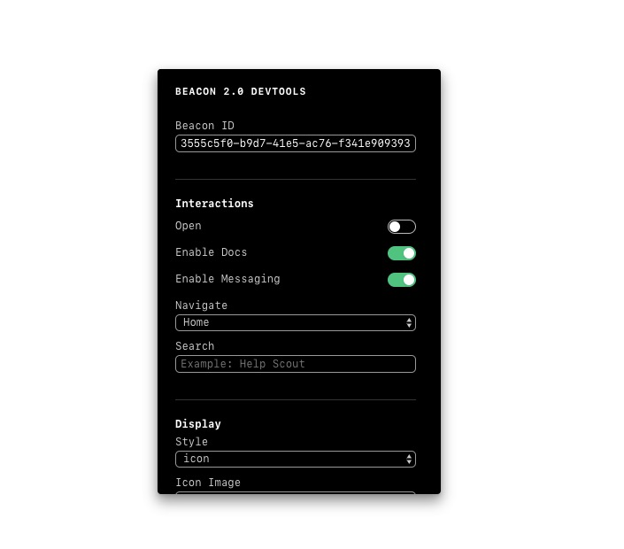

<!-- START doctoc generated TOC please keep comment here to allow auto update -->
<!-- DON'T EDIT THIS SECTION, INSTEAD RE-RUN doctoc TO UPDATE -->

- [Beacon 2.0 DevTools](#beacon-20-devtools)
  - [Installation](#installation)
  - [Usage](#usage)

<!-- END doctoc generated TOC please keep comment here to allow auto update -->

# Beacon 2.0 DevTools

> DevTools for Help Scout's Beacon Embed



## Installation

```
npm install --save-dev @helpscout/beacon-devtools
```

## Usage

```jsx
import React from 'react'
import BeaconDevTools from '@helpscout/beacon-devtools

class MyApp extends React.Component {
  render() {
    return (
      <div>
        ...
        <BeaconDevTools />
      </div>
    )
  }
}
```
